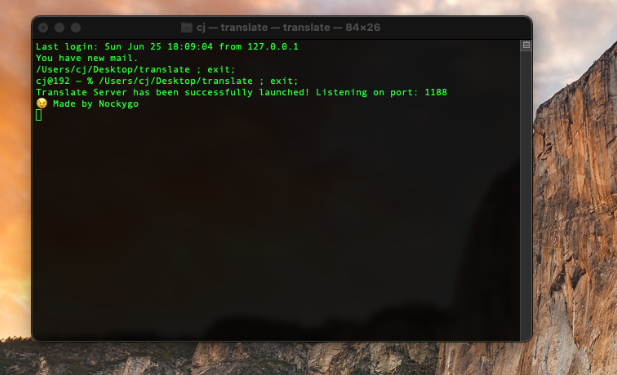
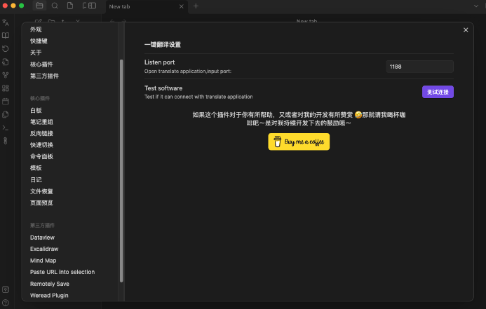
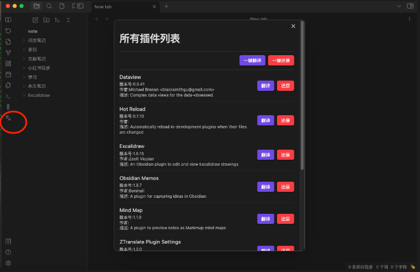
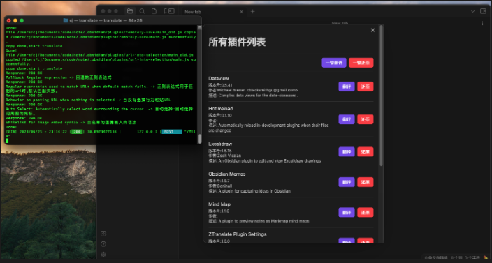
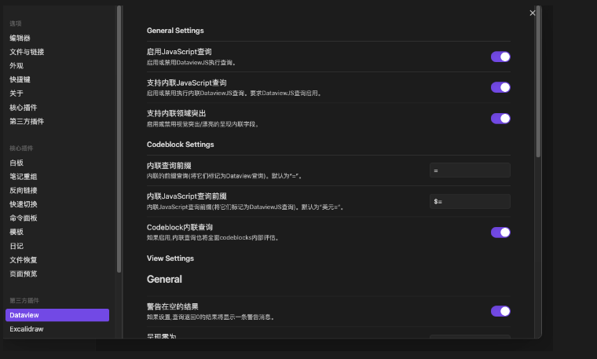
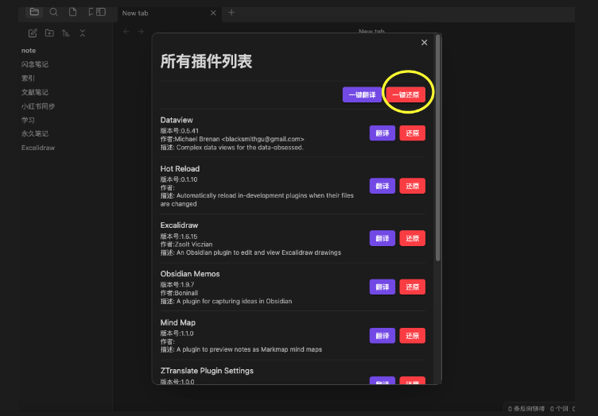
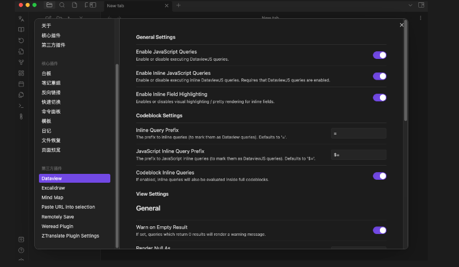

作者：阿三 
博客：[Nockygo](https://blog.asan123.top) 
公众号：阿三爱吃瓜 

> 持续不断记录、整理、分享，让自己和他人一起成长！😊

## 前言

自从用上了Obsidian，就爱上了它，不仅仅是因为它免费，更重要的是它的插件生态很nice，作为一名野生程序猿，流畅不卡是标配，开源那更是极好的，一个好的插件能让我折腾很久，而且还允许我自行去编写插件，一个不满意我就可以去魔改源码😄。

## 插件设置英文看着头疼？

爱折腾插件，没事就去搜索插件提高我的工作效率，久而久之我的插件就会有很多，虽然本猿平时看代码比较多，但是英文的水平还是薄弱的，而很多插件都是国外的大神开发的，设置英文看着头疼，而且obsidian不允许鼠标设置划线，这就很头疼了，往论坛里一看有是有翻译的插件，但是都没有设置翻译的插件，一怒之下自己去学了ts，趁着端午这几天放假，在家做了这款设置翻译插件。

## 使用说明

> 由于还没上架obsidian，我就在github上开源了，ob不允许获取插件列表，所以我就只能本地起一个监听服务来获取插件，同时用了有道翻译，当然是因为可以免费（白piao）！！😛，还不用注册接口账号，（当然也有试过百度翻译，主要是翻译频率限制的挺高，影响翻译的时间）

废话不多说了，正片开始～

### 1. 打开translate软件

打开我为你准备的这个软件，看到Made by Nockygo 那就对了～

### 2.translate插件设置

打开obsidian中的translate插件，端口可以不用动，测试连接下，如果成功，那么就可以下一步操作了，如果失败，可以联系我

### 3. 一键翻译

打开obsidian左侧有个翻译的按钮，点击一键翻译或者选择你想翻译的插件，等待左侧框不跳动了，同时obsidian会有个翻译成功的提示，那就说明翻译结束了，然后重启obsidian

我们用dateview测试下，是不是翻译了？😎😎

### 4. 一键还原

同样的道理，当你觉得翻译的让你不舒服，那你可以选择一键还原或者你想还原的插件，等待有个还原成功的提示，你就可以重启obsidian了～

同样打开dataview，英文又神奇的回来了😁😁

## 总结

插件开发的时间消耗的不是很长，翻译的效果也达到了预期的目的，当然后续如果可以接成百度翻译也当然可以的，同时如果能够翻译成多国语言，那岂不是更完美，这个是后话，主要还得看看空闲的时间咯！

如果你需要这个插件，找到「阿三爱吃瓜」公众号发送“翻译”，即可获得。